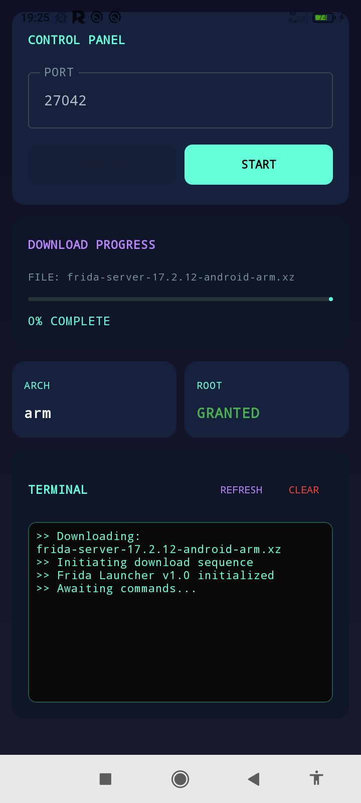
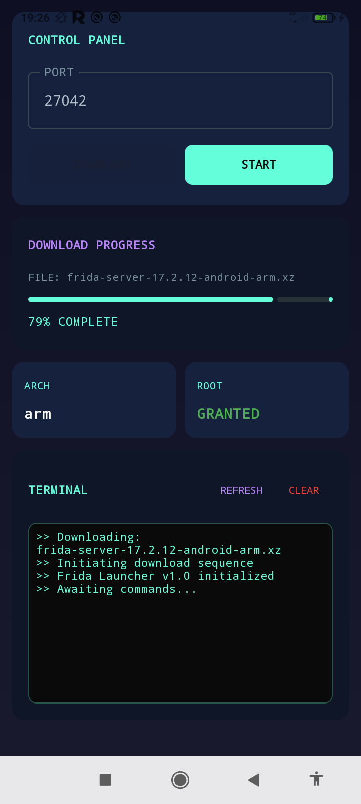
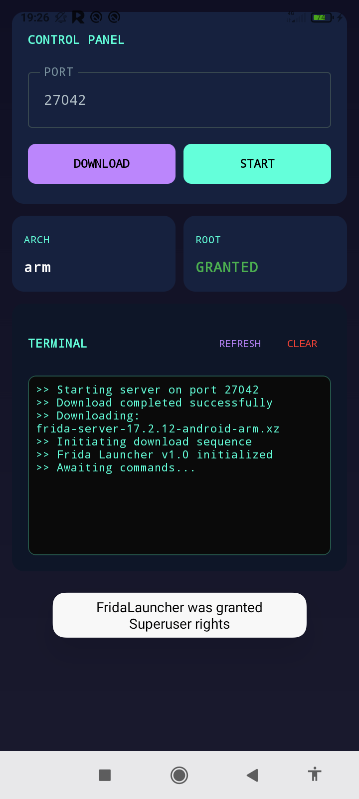

<p align="center">
  
</p>

# Frida Launcher

A modern Android application for downloading, managing, and running Frida server on rooted Android devices. Built with Jetpack Compose and Material 3 design.

## Features

- **Automatic Architecture Detection**: Automatically detects your device's CPU architecture
- **Frida Server Management**: Download, install, and run Frida server directly from the app
- **Custom Port Configuration**: Configure the port Frida server runs on
- **Root Detection**: Checks if your device is rooted using multiple methods
- **Real-time Logging**: View detailed logs of all operations
- **Modern UI**: Built with Jetpack Compose and Material 3 design principles

## Requirements

- Android 7.0 (API level 24) or higher
- Rooted device
- Internet connection for downloading Frida server

## Permissions

The app requires the following permissions:

- `INTERNET`: To download Frida server
- `WRITE_EXTERNAL_STORAGE`: To save Frida server binary
- `ACCESS_SUPERUSER`: To run commands with root privileges
- `REQUEST_INSTALL_PACKAGES`: For installation operations
- `WRITE_INTERNAL_STORAGE`: To manage internal files

## Building from Source

1. Clone the repository
2. Open the project in Android Studio
3. Build and run the app on your device

```bash
# Clone the repository
git clone https://github.com/fdciabdul/Frida-Launcher

# Open in Android Studio and build
```

## Technical Details

- **Language**: Kotlin
- **UI Framework**: Jetpack Compose
- **Minimum SDK**: 24 (Android 7.0)
- **Target SDK**: 36

## Disclaimer

This app is intended for legitimate security research and development purposes only. Always ensure you have permission to use Frida on any target application or device.

## Screenshots

<p align="center">
  
  
  
</p>

## License

[Add your license information here]

---

*Note: Frida is a dynamic instrumentation toolkit developed by Ole André Vadla Ravnås. This launcher is an unofficial tool and is not affiliated with the official Frida project.*